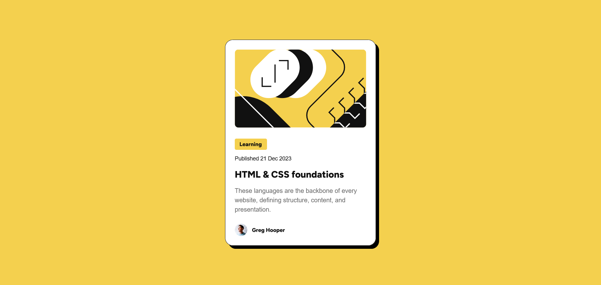

# Frontend Mentor - Blog preview card solution

This is my solution to the [Blog preview card challenge on Frontend Mentor](https://www.frontendmentor.io/challenges/blog-preview-card-ckPaj01IcS).  
A small project focused on building a responsive blog card layout and practicing semantic HTML and modern CSS.

## Table of contents

- [Overview](#overview)
  - [Screenshot](#screenshot)
  - [Links](#links)
- [My process](#my-process)
  - [Built with](#built-with)
- [Author](#author)

## Overview

### Screenshot

### Links

- Solution URL: [GitHub Repository](https://github.com/lxkask/blog-preview-card)
- Live Site URL: [Live Demo on GitHub Pages](https://lxkask.github.io/blog-preview-card/)

## My process

### Built with

- HTML5
- CSS (Flexbox, custom properties, `clamp()` for responsive text)
- Mobile-first workflow
- Google Fonts (Figtree)

## Author

- GitHub - [@lxkask](https://github.com/lxkask)
- Instagram - [@l.xkas](https://www.instagram.com/l.xkas/)
- LinkedIn - [Lukáš Kubík](https://www.linkedin.com/in/luk%C3%A1%C5%A1-kub%C3%ADk-251605245/)
